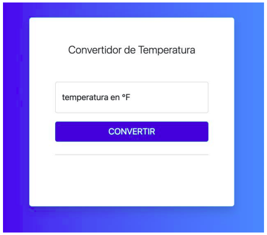

# Grados esperados

EJERCICIO:
La lógica de este código es permitirle al usuario ingresar un valor de temperatura en grados Fahrenheit, y
hacer que el programa convierta el valor por medio de una función async/await. Esto significa que
también tendrás que crear una Promesa. Como recomendación, intenta hacer todos los cálculos de
conversión en la Promesa, y luego puedes llamarla en la función async.
La fórmula para convertir grados Fahrenheit a grados Celsius, es la siguiente: C = (5/9) * (F - 32).

